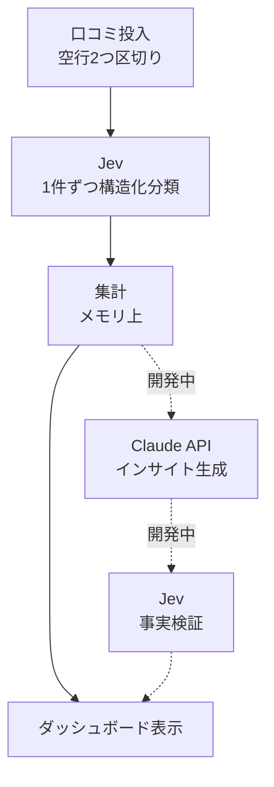

# Restaurant Insight Verifier

飲食店の口コミを貼り付けるだけで、**何が評価され・何が不満なのか**、そして**店主が次に何をすべきか（返信・改善）**を構造化して示す口コミ分析アプリ。

**🔗 デモ: https://restaurant-insight-verifier.vercel.app/**（`main`ブランチから自動デプロイ）

## 解決したい課題

個人〜小規模経営の飲食店は、Googleマップ等に溜まった口コミを分析する余裕がありません。店主に残るのは「なんとなく評判が良い/悪い」という肌感覚だけで、どの要素が評価を左右しているのか、どの口コミに返信すべきかを定量的に把握できていません。

本アプリは、大量の口コミを **Jev（TypeSafe社の小型・高速な判断モデル）** で1件ずつ構造化分類し、集計してダッシュボードに表示します。単なるラベル付けに留まらず、「感謝を伝える返信をすべきか」「謝罪すべきか」「オペレーション/メニューのどちらを改善すべきか」といった**アクションに直結する判定**まで行います。

## 機能

- **口コミの一括投入**: テキストエリアに貼り付け（口コミ同士は空行2つで区切る）
- **アスペクト分類**: 味 / 接客 / 待ち時間 / 清潔さ / コスパ / 見た目 / ニオイ（複数該当可）
- **感情判定**: ポジティブ / ネガティブ / ニュートラル / 賛否混在
- **対応ガイド**: お礼推奨・謝罪推奨、オペレーション改善・メニュー/レシピ改善の要否
- **ダッシュボード**: 各項目の件数集計、Jev処理時間（合計・1件あたり平均）、実行モード（Jev実接続 / モック）の表示
- **口コミ別カード**: 全判定項目の確率をパーセンテージで表示（Jevによる分類であることを明示）

### 開発中（[Issues](https://github.com/yuuki-nishino/restaurant-insight-verifier/issues)）

- Claude APIによるインサイト文の生成（#8）
- Jevによるインサイト文の事実検証と「要確認」バッジ表示（#9）。検証関数 `verifyClaim()` は実装済みで、UIへの接続が残っています

## 設計のポイント

### Jevを「判断のプリミティブ」として使う

Jevは自由記述を生成するのではなく、Yes/Noの確率（**Noul**）などの型付きの判断を返します。公式ドキュメントで推奨されている「複数該当しうる分類は項目ごとに独立したNoul質問にする」パターンに従い、1口コミにつき13個のNoul質問（アスペクト7・感情2・返信2・改善2）を**1リクエストにまとめて**送信しています。

```ts
const response = await client.systemOne({
  state: { review_text: reviewText },
  questions: {
    aspect_taste: noul("この口コミは「味」について言及しているか"),
    reply_apology: noul("この口コミの内容に対して、店側は謝罪を伝える返信をすべきか"),
    // ...
  },
});
```

感情は「ポジティブ確率」「ネガティブ確率」を別々に取得して導出することで、両方高い**賛否混在**の口コミを表現できるようにしています（[ADR-0005](./docs/decisions/0005-sentiment-mixed-and-more-aspects.md)）。

### 外部APIの有無に依存しない開発（モックとの差し替え）

Jevはアーリーアクセスのため、APIキーがなくても動くことを重視しました。`TYPESAFE_API_KEY` の有無で、**同一インターフェースの実装（`live.ts` / `mock.ts`）を切り替え**ます。呼び出し側（集計・表示）は実装の違いを意識しません（[ADR-0001](./docs/decisions/0001-jev-mock-fallback.md)）。

### DBを持たない1リクエスト完結設計

口コミの投入から表示までをサーバーアクションの1回の呼び出し内でメモリ上のみで処理します。単一店舗・単一ユーザーのMVPでは永続化よりも「貼って、すぐ見える」体験と運用コストゼロを優先しました（[ADR-0002](./docs/decisions/0002-no-database-single-run-analysis.md)）。

### 設計判断をADRとして記録

実APIの仕様確認後に設計を修正した経緯（想定スキーマ → 実プリミティブへのマッピング、メニュー分類 → 対応ガイドへの置き換え）を含め、判断の理由を `docs/decisions/` に残しています。

| ADR | 内容 |
| --- | --- |
| [0001](./docs/decisions/0001-jev-mock-fallback.md) | Jev未提供時はモック関数で代替 |
| [0002](./docs/decisions/0002-no-database-single-run-analysis.md) | DBを持たず1リクエストで完結 |
| [0003](./docs/decisions/0003-jev-primitive-mapping.md) | Jevの実プリミティブ（Choice/Score/Noul）への設計マッピング |
| [0004](./docs/decisions/0004-action-guidance-replaces-menu.md) | メニュー分類を対応ガイドに置き換え |
| [0005](./docs/decisions/0005-sentiment-mixed-and-more-aspects.md) | 感情の賛否混在対応とアスペクト追加 |

## アーキテクチャ



```
src/
├── app/
│   ├── actions.ts          # Server Action: 分割 → 並列分類 → 集計 → 計測
│   ├── page.tsx            # 入力フォームと結果表示
│   └── components/         # Dashboard / ReviewCard
└── lib/
    ├── aggregate.ts        # 分類結果の集計
    └── jev/
        ├── index.ts        # キー有無で live / mock を切替
        ├── live.ts         # Jev（TypeSafe SDK）実装
        ├── mock.ts         # キーワードベースのモック実装
        └── types.ts        # 共通の型
```

## 技術スタック

Next.js 16（App Router / Server Actions） · React 19 · TypeScript · Tailwind CSS 4 · [TypeSafe SDK (Jev)](https://docs.typesafe.ai/) · Vercel

## ローカル開発

```bash
npm install
npm run dev   # http://localhost:3000
```

Jevに接続する場合は `.env.local` にAPIキーを設定します。未設定の場合はモックで動作し、画面上に実行モードが表示されます。

```bash
TYPESAFE_API_KEY=your_api_key
```

| コマンド | 内容 |
| --- | --- |
| `npm run dev` | 開発サーバー起動 |
| `npm run build` | 本番ビルド |
| `npm run start` | 本番ビルドの起動 |
| `npm run lint` | ESLint実行 |

## ドキュメント

- [docs/architecture.md](./docs/architecture.md) — 目的・データフロー・画面構成
- [docs/data-model.md](./docs/data-model.md) — ステージ間のデータ型
- [docs/api-spec.md](./docs/api-spec.md) — Jev / Claude API仕様
- [docs/decisions/](./docs/decisions/) — 設計判断の記録（ADR）
- [CLAUDE.md](./CLAUDE.md) — AIエージェント向け開発ガイド
