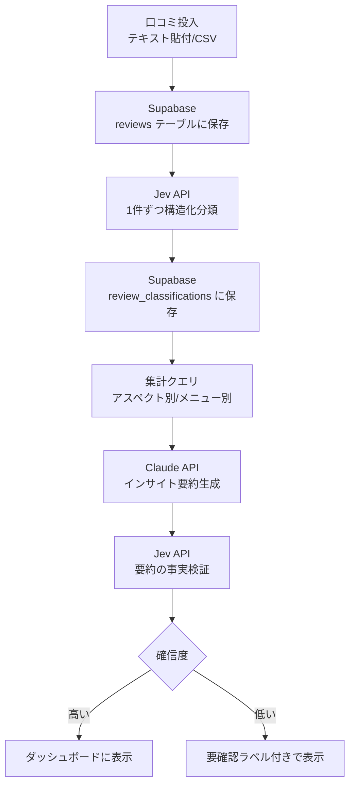

# アーキテクチャ

最終更新: 2026-09-24

## 目的・課題

個人〜小規模経営のラーメン屋は、Googleマップ等に溜まった口コミを分析する余裕がない。店主は「なんとなく良い評判/悪い評判がある」という肌感覚しか持てず、どのメニュー・どの時間帯・どの要因が評価を左右しているかを定量的に把握できていない。

本アプリは、大量の口コミテキストを **Jev** で高速・低コストに構造化分類し、**LLM（Claude API）** がその集計結果から自然言語のインサイトを生成、さらに **Jevが生成されたインサイトを元データと突き合わせて事実チェックする**、という3段構成で「安く速く、かつ誤りの少ない」口コミ分析ツールを実現する。

## データフロー

Jevを分類（C）と検証（G）の2箇所で使う構成が本アプリの核。分類は大量データを安く高速にさばく役割、検証はLLMが生成した文章の事実確認を安く担う役割で、目的が異なる。

## 技術スタック・ホスティング

| レイヤー         | 使用技術                        | コスト                                       |
| ---------------- | ------------------------------- | -------------------------------------------- |
| フロント/API     | Next.js                         | Vercel 無料枠                                |
| DB               | Supabase (Postgres)             | 無料枠                                        |
| 構造化分類・検証 | Jev API（未提供時はモック関数） | アーリーアクセス次第                         |
| インサイト生成   | Claude API                      | 従量課金（呼び出し回数が少ないため低コスト） |
| グラフ表示       | Recharts等                      | 無料                                          |

合計、実データ収集コスト・サーバー固定費ゼロで運用できる構成。

## 画面構成

| 画面                 | 内容                                                                                         |
| -------------------- | -------------------------------------------------------------------------------------------- |
| ① 口コミ投入         | テキストエリアへの一括貼付 or CSVアップロード、「分析開始」ボタン                            |
| ② 処理中             | Jev分類の進捗表示（n/m件処理済み）                                                            |
| ③ ダッシュボード     | アスペクト別件数のグラフ、感情の内訳、メニュー別言及ランキングの表                           |
| ④ インサイトレポート | LLM生成の箇条書きインサイト。各項目にJev検証済みバッジ（確信度が低い場合は「要確認」ラベル） |

MVPは①〜④を1ページの縦スクロールで完結させる想定。

## 関連ドキュメント

- データモデル: [data-model.md](./data-model.md)
- Jev / Claude API仕様: [api-spec.md](./api-spec.md)
- 設計判断の記録: [decisions/](./decisions/)
- 初期構想メモ（MVPスコープ等）: [plan.md](./plan.md)
