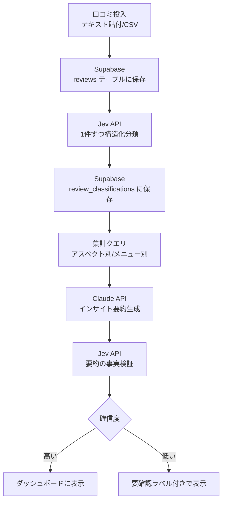

# ラーメン屋 口コミ分析アプリ 仕様書（初期構想メモ）

Sep 23, 2026 · @Someone

> **Note:** このドキュメントは最初に書いた構想メモです。確定した設計は目的別に分割・更新しています。最新情報は以下を参照してください。
>
> - [architecture.md](./architecture.md) — アーキテクチャ・データフロー・技術スタック
> - [data-model.md](./data-model.md) — DBスキーマ
> - [api-spec.md](./api-spec.md) — Jev / Claude API仕様
> - [decisions/](./decisions/) — 設計判断の記録（ADR）
> - タスクはGitHub Issuesで管理

## 目的・課題

個人〜小規模経営のラーメン屋は、Googleマップ等に溜まった口コミを分析する余裕がない。店主は「なんとなく良い評判/悪い評判がある」という肌感覚しか持てず、どのメニュー・どの時間帯・どの要因が評価を左右しているかを定量的に把握できていない。

本アプリは、大量の口コミテキストを**Jev**で高速・低コストに構造化分類し、**LLM（Claude API）**がその集計結果から自然言語のインサイトを生成、さらに**Jevが生成されたインサイトを元データと突き合わせて事実チェックする**、という3段構成で「安く速く、かつ誤りの少ない」口コミ分析ツールを実現する。

## MVPスコープ（明日やること／やらないこと）

1日で動くものを作り切ることを優先し、範囲を絞る。

**やること**

- サンプル口コミ（テキストファイル or ペースト）の一括投入
- Jevによる1件ずつの構造化分類（アスペクト・感情・言及メニュー）
- 分類結果の集計・ダッシュボード表示（テーブル＋簡易グラフ）
- LLMによる「今月のインサイト」要約生成（1回のみ呼び出し）
- Jevによるインサイト文の事実検証（低確信度なら警告表示）

**やらないこと（次回以降）**

- Google Places API等による口コミの自動取得（手動投入で十分）
- ユーザー認証・複数店舗管理
- 時系列の異常検知、メニュー別スコアリングの高度化
- モバイル対応の作り込み（PC表示のみでOK）

## アーキテクチャ（データフロー）



Jevを分類（C）と検証（G）の2箇所で使う構成が本アプリの核。分類は大量データを安く高速にさばく役割、検証はLLMが生成した文章の事実確認を安く担う役割で、目的が異なる。

## データモデル（Supabase / Postgres）

| テーブル                 | 主なカラム                                                                                                                  | 用途                                          |
| ------------------------ | --------------------------------------------------------------------------------------------------------------------------- | --------------------------------------------- |
| `reviews`                | id, raw_text, source(手動/CSV), posted_at, created_at                                                                       | 投入された口コミの原文                        |
| `review_classifications` | id, review_id(FK), aspect(味/接客/待ち時間/清潔さ/コスパ), sentiment(positive/negative/neutral), menu_mentioned, confidence | Jevの分類結果1件につき1行                     |
| `insight_reports`        | id, period(対象月), summary_text, generated_at                                                                              | LLMが生成したインサイト文                     |
| `insight_verifications`  | id, insight_report_id(FK), claim_text, is_supported(bool), confidence, note                                                 | Jevによる検証結果（インサイト文中の主張ごと） |

MVPでは店舗テーブル・ユーザーテーブルは作らず、単一店舗・単一ユーザー前提でシンプルに保つ。

## Jev API仕様（入出力スキーマ）

### ① 分類クエリ（口コミ1件ごと）

**入力（state）**

```json
{
  "review_text": "スープは美味しいけど提供まで40分待った。接客も素っ気なかった"
}
```

**分類させる質問（decision）**

- aspect: \["味", "接客", "待ち時間", "清潔さ", "コスパ", "その他"\] から言及されているものを全て
- sentiment: \["positive", "negative", "neutral"\]
- menu_mentioned: 自由記述（メニュー名が言及されていれば抽出、なければnull）

**出力例**

```json
{
  "aspect": [
    { "label": "味", "confidence": 0.91 },
    { "label": "待ち時間", "confidence": 0.88 },
    { "label": "接客", "confidence": 0.76 }
  ],
  "sentiment": { "label": "negative", "confidence": 0.72 },
  "menu_mentioned": null
}
```

### ② 検証クエリ（LLMのインサイト文チェック）

**入力（state）**

- LLMが生成したインサイト文の1主張（例：「待ち時間への不満が先月比で増加」）
- 集計済みの構造化データ（該当月・前月の aspect=待ち時間 の件数）

**分類させる質問（decision）**

- is_supported: \["true", "false"\] — この主張は集計データで裏付けられるか

**出力例**

```json
{ "is_supported": { "label": "true", "confidence": 0.94 } }
```

MVP実装時点でJevの一般公開APIが利用できない場合は、同じ入出力スキーマを持つモック関数（ルールベースの簡易分類）で代替し、後日本物のJev APIに差し替えられる設計にしておく。

## LLM（Claude API）仕様

呼び出しは分析実行1回につき1回のみ。入力はJevの分類結果を集計したJSON（アスペクト別件数、メニュー別言及数、感情の内訳など）。

**プロンプト方針**

- 「以下の集計データだけを根拠に、店主向けのインサイトを3〜5個、箇条書きで生成して」
- 各インサイトは「観測された事実（件数・割合）＋示唆」の2部構成にする
- 集計データにない推測（因果関係の断定など）は避け、「〜の可能性がある」と書かせる
- 出力はJSON配列（`{claim_text, evidence}`の配列）で構造化させ、②の検証クエリにそのまま渡せる形にする

## 画面構成

| 画面                 | 内容                                                                                         |
| -------------------- | -------------------------------------------------------------------------------------------- |
| ① 口コミ投入         | テキストエリアへの一括貼付 or CSVアップロード、「分析開始」ボタン                            |
| ② 処理中             | Jev分類の進捗表示（n/m件処理済み）                                                           |
| ③ ダッシュボード     | アスペクト別件数のグラフ、感情の内訳、メニュー別言及ランキングの表                           |
| ④ インサイトレポート | LLM生成の箇条書きインサイト。各項目にJev検証済みバッジ（確信度が低い場合は「要確認」ラベル） |

MVPは①〜④を1ページの縦スクロールで完結させる想定。

## 技術スタック・ホスティング

| レイヤー         | 使用技術                        | コスト                                       |
| ---------------- | ------------------------------- | -------------------------------------------- |
| フロント/API     | Next.js                         | Vercel 無料枠                                |
| DB               | Supabase (Postgres)             | 無料枠                                       |
| 構造化分類・検証 | Jev API（未提供時はモック関数） | アーリーアクセス次第                         |
| インサイト生成   | Claude API                      | 従量課金（呼び出し回数が少ないため低コスト） |
| グラフ表示       | Recharts等                      | 無料                                         |

合計、実データ収集コスト・サーバー固定費ゼロで運用できる構成。

## 実装タスク

タスクはGitHub Issuesで管理している（[Issues一覧](https://github.com/yuuki-nishino/restaurant-insight-verifier/issues)）。`mvp`ラベルが付いたIssueが「動くデモ」に必須のコアタスク、`mvp-stretch`ラベルは時間が余れば対応するタスク。
